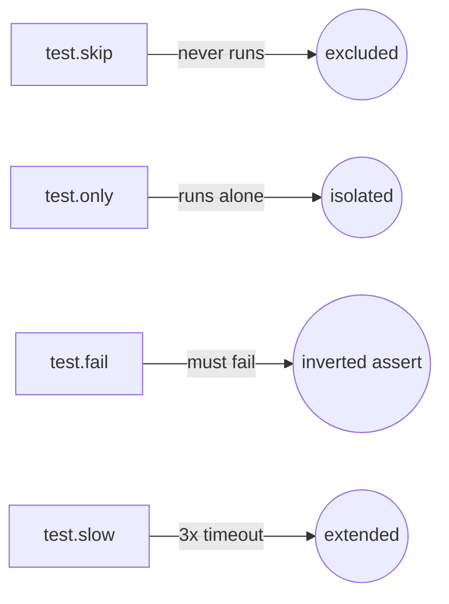
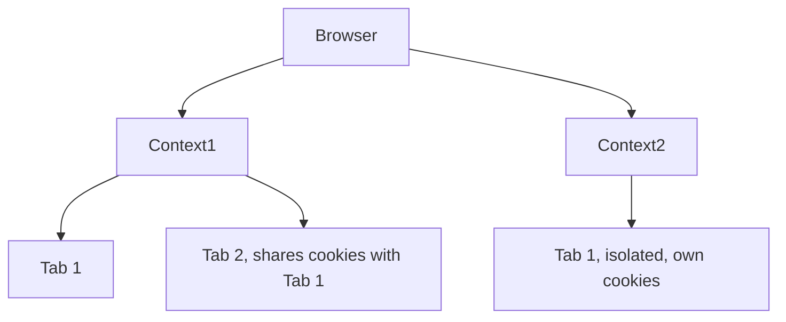
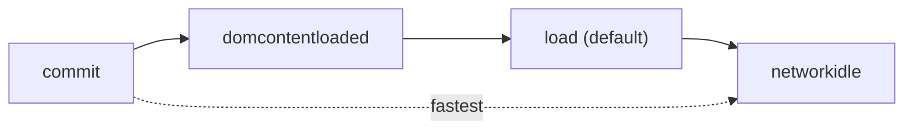
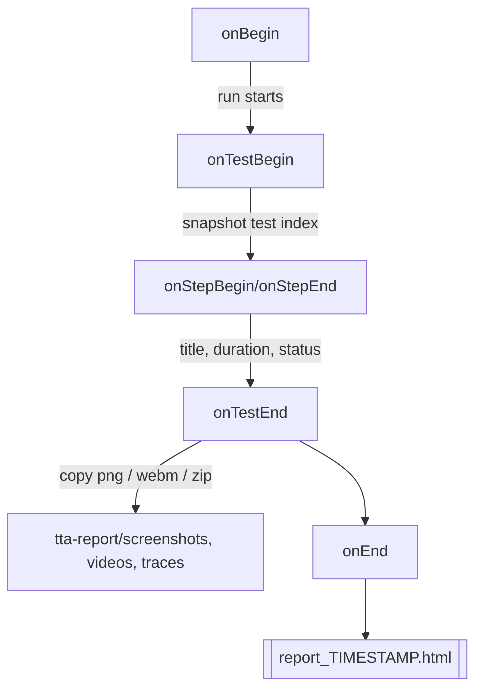
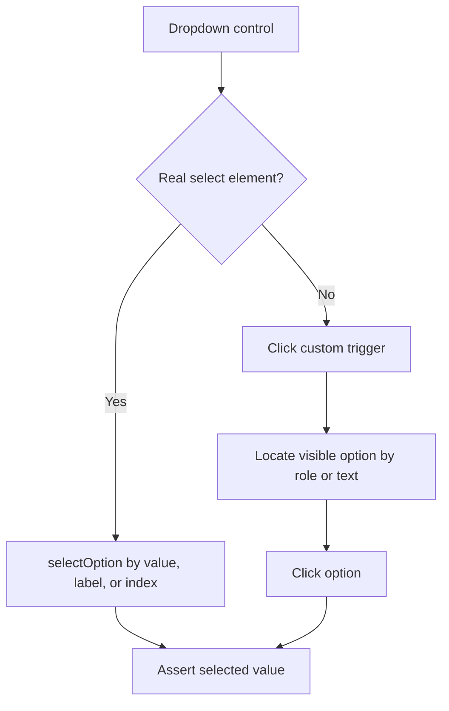
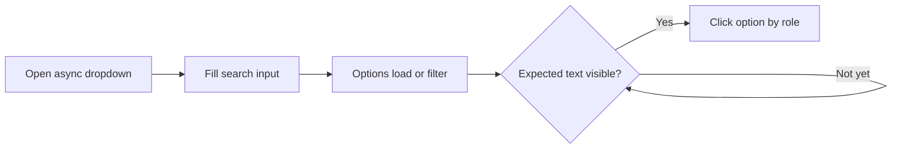
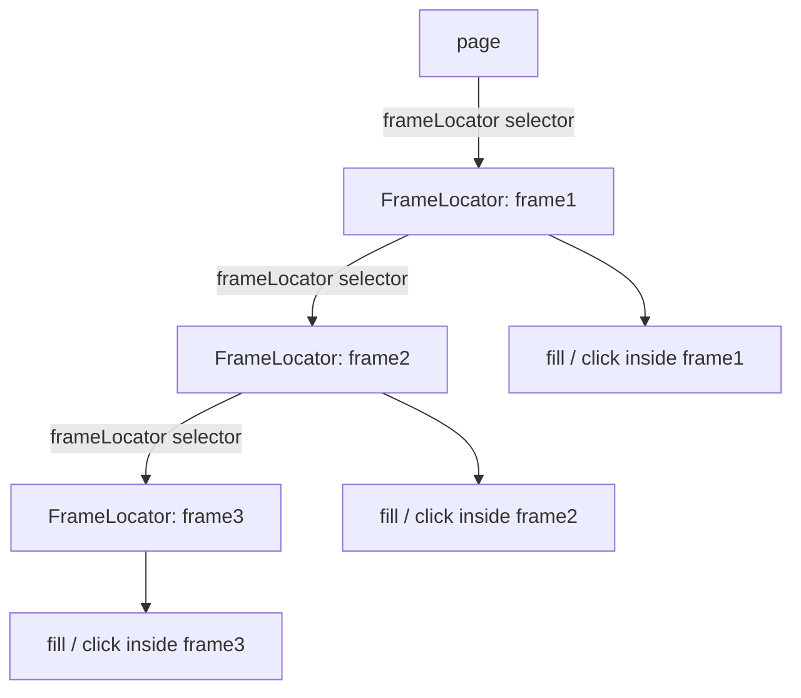
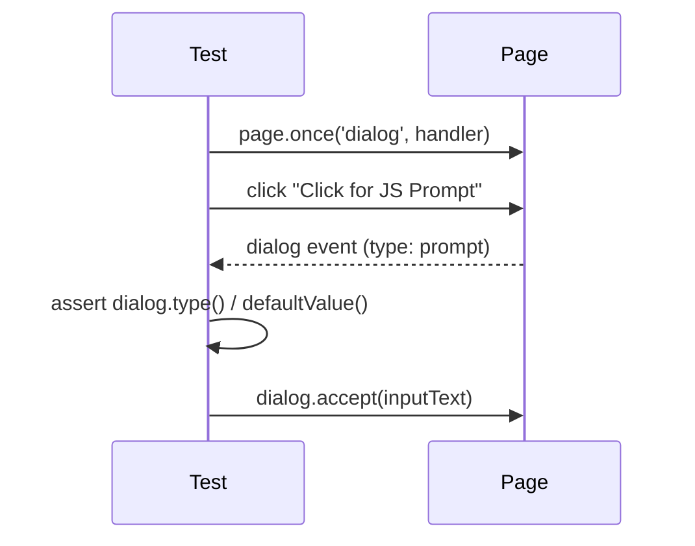

# Learning Playwright Fundamentals 2x

A hands-on starter project for learning [Playwright](https://playwright.dev/) end-to-end testing with TypeScript. Part of **The Testing Academy** Playwright Fundamentals course.

## Tech Stack

- [Playwright Test](https://playwright.dev/docs/intro) `^1.61.1`
- TypeScript / Node.js (`@types/node`)

## Prerequisites

- [Node.js](https://nodejs.org/) 18+ (LTS recommended)
- npm (ships with Node)

## Getting Started

```bash
# 1. Install dependencies
npm install

# 2. Install Playwright browsers
npx playwright install

# 3. Set up credentials (needed for module 04's session-storage lab)
cp .env.example .env
# then edit .env and add your own VWO_USER / VWO_PASS
```

## Running Tests

```bash
# Run all tests (headed, per playwright.config.ts)
npx playwright test

# Explicitly run in headed mode (watch the browser)
npx playwright test --headed

# Run a single spec
npx playwright test tests/example.spec.ts

# Run in UI mode (interactive)
npx playwright test --ui

# Run by priority tag (module 18)
npm run test:p1          # only @p1
npm run test:priority    # @p1, then @p2, then @p3

# Debug a test
npx playwright test --debug
```

## Viewing the Report

This repo ships a custom TTA HTML reporter (see module 05). After a run:

```bash
# Newest run (index.html always redirects to the latest report)
open tta-report/index.html

# Every past run, newest first
open tta-report/history.html
```

The report updates live *while* tests run — leave it open in a browser tab and it refreshes every 5s.

## Project Structure

```
.
├── tests/
│   ├── 01_Basics/                    # Test anatomy, annotations (skip/only/fail/slow)
│   ├── 02_First_tests/               # Browser → Context → Page (BCP) hierarchy
│   ├── 03_Locators_Commands/         # Lazy locators, strict mode, auto-wait, built-ins
│   ├── 04_Session_Storage/           # storageState: log in once, reuse the session
│   ├── 05_Allure_Reporting/          # Custom TTA HTML reporter + test.step
│   ├── 06_Multiple_Element_/         # allInnerTexts / all() loops, getByTestId
│   ├── 07_WebTables/                 # Dynamic XPath, filter()/:has() row targeting, pagination
│   ├── 08_Web_Select_Frames_Iframe/  # Native, custom, multi-select, tag-style & async dropdowns
│   ├── 09_Frame_Iframe/              # frameLocator, nested iframes, enumerating //frame
│   ├── 10_Keyboard_Hover_Drag_Drop/  # keyboard API, hover menus, drag & drop, right-click
│   ├── 11_JS_Alerts/                 # alert / confirm / prompt dialog handling
│   ├── 12_Handle_SVG/                # svg locator, shape/chart clicks, SVG map path attributes
│   ├── 13_Shadow_DOM/                # Shadow-piercing locators, nested shadow roots
│   ├── 14_FileUpload/                # setInputFiles: disk paths, Buffers, multi-file
│   ├── 15_File_Download/             # waitForEvent('download'), saveAs, suggestedFilename
│   ├── 16_Scroll_toElement/          # scrollIntoViewIfNeeded, window.scrollBy/scrollTo, lazy lists
│   ├── 17_Expect_Assertions/         # Value vs locator assertions, soft assertions, negation
│   ├── 18_Test_hooks/                # Hooks, modifiers, describe modes, tags & priority runs
│   ├── 19_Data_Driven_Testing/       # DDT from JSON, CSV, YAML, MySQL, Excel & Faker
│   │   ├── test-data/                # login.json, *.csv, *.yml, *.sql, *.xlsx fixtures
│   │   └── util/                     # csvReader, yamlReader, dbReader, excelReader
│   ├── 20_Page_Object_Model/         # POM: LoginPage, Inventory, no-POM vs POM comparison
│   ├── 21_… … 23_Advance_Framework/  # Remaining curriculum modules (scaffolded, WIP)
│   ├── Template.spec.ts              # Empty spec scaffold, copy for new tests
│   └── example.spec.ts               # Sample: title check + "Get started" navigation
├── utils/
│   └── CustomReporter.ts   # Custom TTA HTML reporter (implements Playwright's Reporter)
├── playwright.config.ts    # Playwright configuration
├── tsconfig.json           # TS compiler options for specs (ES2022, CommonJS, node types)
├── .env.example            # Template for VWO_USER / VWO_PASS — copy to .env
├── package.json
└── .gitignore
```

> **Secrets:** `.env` and `user-session.json` are gitignored. Copy `.env.example` to `.env` and add your own VWO credentials before running module 04.

## What's Inside

`tests/example.spec.ts` demonstrates two core patterns:

1. **Assertions** — verify the page title matches `/Playwright/`.
2. **Navigation + role locators** — click the *Get started* link and assert the *Installation* heading is visible.

### 01 - Test Anatomy & Annotations

**Concept:** every Playwright spec is `test(name, async ({ page }) => {...})`: `page` is a fixture, injected fresh per test, not something you create. Annotations (`.skip`, `.only`, `.fail`, `.slow`) tag a test's execution mode without touching its body.

**Why:** during dev you constantly need to isolate one test (`.only`), silence a broken one (`.skip`), or flag a known-fail (`.fail`), without commenting code out.

**Q&A: why use this?**
- **Q: What breaks if `test.only` ships to CI?** A: Every other test in that run gets skipped, most CI configs (`forbidOnly: !!process.env.CI`) fail the build to catch this.
- **Q: `.skip` vs `.fail`?** A: `.skip` never runs the test. `.fail` runs it and expects a failure, flips to an error if it unexpectedly passes.
- **Q: Can I skip conditionally?** A: Yes, `test.skip(condition, reason)` inside the test body, e.g. skip only on `firefox`.


```mermaid
flowchart LR
    A[test.skip] -->|never runs| X((excluded))
    B[test.only] -->|runs alone| Y((isolated))
    C[test.fail] -->|must fail| Z((inverted assert))
    D[test.slow] -->|3x timeout| W((extended))
```

```ts
// Conditional skip, reads browserName from the fixture
test('conditional', async ({ page, browserName }) => {
    test.skip(browserName === 'firefox', 'Not supported in Firefox');
});
```

### 02 - Browser, Context, Page (BCP) Hierarchy

**Concept:** Playwright models automation in three nested layers: one **Browser** process, many **Contexts** (isolated sessions, like separate incognito windows), each with many **Pages** (tabs). Cookies/storage never leak across contexts; pages in the same context share them.

**Why:** testing multi-user flows (admin + guest, two logged-in accounts) needs real session isolation, launching a whole new browser per user is wasteful; a new context is cheap and isolated.

**Q&A: why use this?**
- **Q: When do I need a second context instead of a second page?** A: When the two sessions must NOT share cookies/auth, e.g. admin vs. viewer logged in simultaneously.
- **Q: Does the `test()` fixture give me a context for free?** A: Yes, `{ page }` already comes with its own context. Use `{ browser }` when a test needs to spin up *extra* contexts manually.
- **Q: What's the cleanup order?** A: Reverse of creation: close pages, then contexts, then the browser.


```mermaid
flowchart TD
    Browser --> Context1
    Browser --> Context2
    Context1 --> Page1["Tab 1"]
    Context1 --> Page2["Tab 2, shares cookies with Tab 1"]
    Context2 --> Page3["Tab 1, isolated, own cookies"]
```

```ts
test("two users interact", async ({ browser }) => {
    const adminContext = await browser.newContext();
    const adminPage = await adminContext.newPage();

    const guestContext = await browser.newContext();
    const guestPage = await guestContext.newPage();

    await adminPage.goto("https://app.vwo.com/#login");
    await guestPage.goto("https://app.vwo.com/#dashboard/home");

    await adminContext.close();
    await guestContext.close();
});
```

Context options (`viewport`, `locale`, `timezoneId`, `geolocation`, or a full device profile like `userAgent` + `isMobile` for mobile emulation) are passed into `browser.newContext({...})`, see [`237_BCP_Test_Options.spec.ts`](tests/02_First_tests/237_BCP_Test_Options.spec.ts).

### 03 - Locators & Commands

**Concept:** a locator (`page.locator(...)`) does not find the element immediately, it is a lazy, re-queryable reference. Playwright resolves it fresh at action time and auto-waits (strict mode: exactly one match, or it throws) until the element is actionable.

**Why:** DOM elements re-render (React/Vue re-mount, AJAX swaps content); a locator that re-queries on every action survives that churn, unlike a one-time `document.querySelector` handle.

**Q&A: why use this?**
- **Q: What is "strict mode"?** A: `locator()` throws if a selector resolves to more than one element, forcing you to narrow the selector instead of silently acting on the first match.
- **Q: CSS selector cheat sheet?** A: `#id` for id, `.class` for className, `[name="value"]` for the name attribute, bare `tag` for a tag selector.
- **Q: Why does `.fill()` succeed without a manual wait?** A: Auto-wait, Playwright polls the element until visible, enabled, and stable before firing the action.


```mermaid
flowchart LR
    A[page.locator&#40;selector&#41;] -->|lazy, no DOM query yet| B{Action called: .fill&#40;&#41;, .click&#40;&#41;}
    B --> C[Resolve selector now]
    C --> D{Strict mode: 1 match?}
    D -->|No| E[Throw]
    D -->|Yes| F[Auto-wait: visible, enabled, stable]
    F --> G[Perform action]
```

```ts
test("TC#1 - Verify VWO login error with lazy, strict, and auto-wait", async ({ page }) => {
    await page.goto("https://app.vwo.com/#login");

    const userNameField = page.locator('#login-username');
    const passwordField = page.locator("#login-password");
    const loginButton = page.locator("#js-login-btn");

    await userNameField.fill("admin@admin.com");
    await passwordField.fill("pass123");
    await loginButton.click();

    const error_message = page.locator('#js-notification-box-msg');
    await expect(error_message).toContainText("Your email, password, IP address or location did not match");
});
```

#### 03.1 - Built-in Locators (`getByRole` / `getByText`)

**Concept:** instead of CSS/XPath, Playwright ships user-facing locators that find elements the way a human or screen reader does: `getByRole`, `getByText`, `getByLabel`, `getByPlaceholder`, `getByTestId`, `getByAltText`, `getByTitle`. `getByRole` targets the accessibility role (button, textbox, checkbox) plus its accessible name.

**Why:** role/text locators survive CSS refactors and hashed class names (e.g. VWO's `C(--common-color-red) invalid-reason`), because they bind to what the user sees, not to brittle markup.

**Q&A: why use this?**
- **Q: When `getByRole` vs `getByText`?** A: `getByRole` for interactive controls (button, textbox, link, checkbox); `getByText` for plain, non-interactive content like a `<div>` error message with no ARIA role.
- **Q: Why does a bare `<div>` resist `getByRole`?** A: It resolves to the `generic` role with no accessible name, so there's nothing stable to target, `getByText` matches its visible text instead.
- **Q: How do I make an error assertion robust?** A: Prefer `getByTestId('email-error')` if devs add `data-testid`; otherwise `getByText(...)`, never the hashed CSS class.


```mermaid
flowchart TD
    Q{Element interactive?} -->|Yes| R["getByRole&#40;'textbox', {name}&#41;"]
    Q -->|No, plain text| T["getByText&#40;'...'&#41;"]
    Q -->|Has data-testid| D["getByTestId&#40;'...'&#41;"]
    R --> A[Action or assert]
    T --> A
    D --> A
```

```ts
test("signup error via built-in locators", async ({ page }) => {
    await page.goto("https://vwo.com/free-trial/");
    await page.getByRole('textbox', { name: "email" }).fill("abcd");
    await page.getByRole('checkbox').check();
    await page.getByRole('button', { name: "Create a Free Trial Account" }).click();

    // Plain <div> error: no role, match the visible text
    await expect(
        page.getByText('The email address you entered is incorrect.')
    ).toBeVisible();
});
```

#### 03.2 - Navigation Options (`waitUntil`, `referer`)

**Concept:** `page.goto(url, options)` controls *when* the call resolves via `waitUntil`: `commit` (server responded) → `domcontentloaded` (HTML parsed) → `load` (default, all resources) → `networkidle` (no requests for 500ms). `referer` sets the `Referer` header so the server thinks the user arrived from a given page.

**Why:** waiting for full `load`/`networkidle` on a heavy SPA wastes seconds when your assertion only needs the DOM, dialing `waitUntil` down speeds tests; `referer` reproduces analytics/attribution flows.

**Q&A: why use this?**
- **Q: What's the default?** A: `load`, Playwright waits for the `load` event (images, CSS, scripts) before `goto` resolves.
- **Q: When use `domcontentloaded`?** A: When you only need parsed HTML and will `await` your own locator afterwards anyway, auto-wait covers the rest.
- **Q: Why is `networkidle` discouraged?** A: It's flaky on pages with polling/websockets that never go idle, prefer web-first assertions over `networkidle`.


```mermaid
flowchart LR
    A[commit] --> B[domcontentloaded]
    B --> C["load (default)"]
    C --> D[networkidle]
    A -. fastest .-> D
```

```ts
test("goto with waitUntil + referer", async ({ page }) => {
    await page.goto("https://app.com/page2", { waitUntil: "domcontentloaded" });
    await page.goto("https://app.com/landing", {
        referer: "https://google.com/search?q=testing+academy"
    });
});
```

#### 03.3 - Typing Char-by-Char (`pressSequentially`) & History

**Concept:** `fill()` sets an input's value in one shot; `pressSequentially(text, { delay })` types character by character, firing real `keydown`/`keyup` per key. `page.goBack()` / `page.goForward()` drive browser history.

**Why:** some inputs only react to real key events, autocomplete dropdowns, input masks, key-listeners, where `fill()` is too instant to trigger them.

**Q&A: why use this?**
- **Q: `fill` vs `pressSequentially`?** A: Use `fill` by default (fast, reliable); reach for `pressSequentially` only when the UI needs per-keystroke events.
- **Q: What does `delay` do?** A: Milliseconds between keystrokes, mimics human typing so debounced handlers/suggestions fire.
- **Q: How do I go back a page?** A: `await page.goBack()`, returns a response for the previous history entry (or null if none).


```mermaid
flowchart LR
    A["fill&#40;text&#41;"] -->|one shot, sets value| V[Value set]
    B["pressSequentially&#40;text, {delay}&#41;"] -->|key by key| K[keydown/keyup per char]
    K --> E[Triggers autocomplete / masks]
```

```ts
test("type key-by-key then navigate history", async ({ page }) => {
    await page.goto("https://awesomeqa.com/practice.html");
    await page.locator('[name="firstname"]')
        .pressSequentially("the testing academy", { delay: 200 });

    await page.goto("https://app.vwo.com/login");
    await page.goBack();
});
```

### 04 - Session Storage (Log In Once)

**Concept:** `context.storageState({ path })` snapshots cookies + localStorage to a JSON file after a real login. Any later test loads it with `test.use({ storageState: "./user-session.json" })` and starts already authenticated, skipping the login UI entirely.

**Why:** driving the login form in every test is slow (3-5s each), brittle (a selector change breaks the whole suite), and tests nothing new after the first run.

**Q&A: why use this?**
- **Q: Why does my saved session come back empty?** A: You snapshotted before login finished. Wait for the post-login URL (`await page.waitForURL(/#\/(dashboard|home)/)`) *then* call `storageState`.
- **Q: Where do the credentials go?** A: `.env` (gitignored), read via `dotenv`. Never hardcode them — this repo is public, and pushed secrets live in git history forever.
- **Q: Does the session expire?** A: Yes. It's a real auth cookie with a real TTL — re-run `247_SessionStorage.spec.ts` to refresh it, and never commit the JSON.


```mermaid
flowchart LR
    A["247: saveSession&#40;&#41;"] -->|real login, once| B[waitForURL: dashboard]
    B --> C["storageState&#40;{path}&#41;"]
    C --> D[(user-session.json)]
    D -->|test.use| E["248 / 249: goto dashboard"]
    E --> F((No login form))
```

```ts
// Step 1 — save the session once (reads creds from .env, never hardcoded)
await page.fill("#login-username", process.env.VWO_USER!);
await page.fill("#login-password", process.env.VWO_PASS!);
await page.click("#js-login-btn");
await page.waitForURL(/#\/(dashboard|home)/, { timeout: 15000 });
await context.storageState({ path: "./user-session.json" });

// Step 2 — every later spec starts logged in
test.use({ storageState: "./user-session.json" });

test("go directly to dashboard — no login", async ({ page }) => {
    await page.goto("https://app.wingify.com/#/dashboard/get-started?accountId=1227004");
    await expect(page).toHaveURL(/dashboard/);
});
```

### 05 - Custom Reporter & Test Steps

**Concept:** a reporter is a class implementing Playwright's `Reporter` interface — `onBegin`, `onTestBegin`, `onStepEnd`, `onTestEnd`, `onEnd`. Playwright calls these hooks as the run happens; what you build from them is yours. [`utils/CustomReporter.ts`](utils/CustomReporter.ts) writes a live-refreshing TTA-branded HTML report with per-step screenshots, videos, traces, and console logs.

**Why:** the built-in HTML reporter is generic. A custom reporter puts *your* branding, priority filters, and per-step evidence in front of stakeholders who will never open a CLI.

**Q&A: why use this?**
- **Q: How does the reporter know my steps?** A: `test.step("...")` fires `onStepBegin`/`onStepEnd`. No steps in the spec = a flat, useless report. The steps *are* the report.
- **Q: How do screenshots land inside the right step?** A: Attach with a `step-<index>-` prefixed name (`testInfo.attach("step-0-loaded", ...)`); the reporter matches that prefix to the step index.
- **Q: Why did both tests show the same video?** A: A real bug this module fixes — `testCounter` was incremented in `onTestBegin` but read in `onTestEnd`. Under `fullyParallel`, both tests begin before either ends, so both read the same index and overwrote each other's artifacts. Snapshot the index per test at begin.


```mermaid
flowchart TD
    A[onBegin] -->|run starts| B[onTestBegin]
    B -->|snapshot test index| C[onStepBegin/onStepEnd]
    C -->|title, duration, status| D[onTestEnd]
    D -->|copy png / webm / zip| E[tta-report/screenshots, videos, traces]
    D --> F[onEnd]
    F --> G[[report_TIMESTAMP.html]]
```

```ts
// playwright.config.ts — point Playwright at the class
reporter: [["line"], ["./utils/CustomReporter.ts"]],

// The spec: steps + prefixed attachments feed the reporter's hooks
test("go directly to dashboard — no login @P0 @smoke", async ({ page }, testInfo) => {
    await test.step("Open VWO dashboard using saved session", async () => {
        await page.goto("https://app.wingify.com/#/dashboard/get-started?accountId=1227004");
        await testInfo.attach("step-0-dashboard-loaded", {
            body: await page.screenshot(),
            contentType: "image/png",
        });
    });

    await test.step("Verify dashboard URL loaded", async () => {
        await expect(page).toHaveURL(/dashboard/);
    });
});
```

Open the result at `tta-report/index.html` (always redirects to the newest run); `tta-report/history.html` lists every past run. `@P0` / `@smoke` tags in the test title drive the report's Priority column and filters.

| | Built-in HTML | Allure | Custom TTA Reporter |
|:--|:--|:--|:--|
| Setup | zero | extra dep + CLI | one file you own |
| Branding | none | limited | total |
| Live during run | no | no | yes (auto-refresh) |
| Best for | daily local dev | large teams, history trends | stakeholder demos, courses |

### 06 - Handling Multiple Elements

**Concept:** when a selector matches many elements, `.allInnerTexts()` returns a `string[]` of every match's text and `.all()` returns a `Locator[]` you can loop over. Iterate, test each, then act on the one you want, or skip the loop entirely and target a unique `data-testid`.

**Why:** lists, nav menus, and result sets have repeated markup (`a.list-group-item` × N). A bare `getByText`/`getByRole` hits strict-mode (>1 match) and throws, so you either narrow to a unique attribute or fan out over the collection.

**Q&A: why use this?**
- **Q: `allInnerTexts()` vs `all()`?** A: `allInnerTexts()` gives you the text values (`string[]`) for reading/filtering; `all()` gives you the `Locator[]` when you need to act (`.click()`, `.getAttribute()`) on each element.
- **Q: Loop match still throws "strict mode violation" — why?** A: `getByText(linkText)` can itself match many nodes; chain `.first()` to pin one, or better, use a unique `getByTestId`.
- **Q: When skip the loop entirely?** A: The moment devs expose a stable `data-testid` — `getByTestId('forgotten-password-link').click()` is one line and can't drift.


```mermaid
flowchart TD
    Q{Element uniquely identifiable?} -->|Yes, data-testid| D["getByTestId&#40;'...'&#41;.click&#40;&#41;"]
    Q -->|No, repeated markup| L["locator&#40;'a.list-group-item'&#41;"]
    L --> T["allInnerTexts&#40;&#41; → string[]"]
    L --> A["all&#40;&#41; → Locator[]"]
    T -->|filter for target| C["getByText&#40;t&#41;.first&#40;&#41;.click&#40;&#41;"]
    A -->|per element| G["getAttribute&#40;'href'&#41;"]
```

```ts
await page.goto("https://app.thetestingacademy.com/playwright/multiple_element_filter");

// Read every link's text
const texts: string[] = await page.locator("a.list-group-item").allInnerTexts();
for (const linkText of texts) {
    if (linkText === "Forgotten Password") {
        await page.getByText(linkText).first().click();   // .first() avoids strict-mode throw
    }
}

// Or act on each Locator directly
for (const link of await page.locator('a.list-group-item').all()) {
    console.log(await link.getAttribute("href"));
}

// Cleanest when a testid exists — no loop at all
await page.getByTestId('forgotten-password-link').click();
```

### 07 - Web Tables (Dynamic Extraction)

**Concept:** an HTML `<table>` is a grid of `tr` rows and `td` cells. Two ways to walk it: build a **dynamic XPath** per cell (`.../tr[i]/td[j]`) inside a nested loop, or use Playwright's `.nth(i)` on a row locator and pull each row's cells with `.allInnerTexts()`.

**Why:** table data is positional and often dynamic (row order changes, new rows appear). Hardcoding `tr[5]/td[2]` breaks the moment the data shifts, so you compute the path or index at runtime and search by content.

**Q&A: why use this?**
- **Q: Dynamic XPath vs `.nth()`?** A: XPath string-building shines when you need axis tricks like `following-sibling::td` (jump from the matched cell to its neighbour); `.nth()` + `allInnerTexts()` is cleaner for reading a whole row as an array.
- **Q: Why start the row loop at `i = 2`?** A: `tr[1]` is the header row; data begins at `tr[2]`. XPath is 1-indexed, unlike `.nth()` which is 0-indexed.
- **Q: How do I grab a value in the same row as a match?** A: Find the cell by text, then hop sideways with `${cellPath}/following-sibling::td` instead of guessing the column index.


```mermaid
flowchart TD
    S[Locate table] --> R["count&#40;&#41; rows &amp; cols"]
    R --> L{Loop i=2..rows, j=1..cols}
    L --> P["build XPath tr[i]/td[j]"]
    P --> M{cell text matches target?}
    M -->|Yes| F["following-sibling::td → related value"]
    M -->|No| L
```

```ts
await page.goto("https://awesomeqa.com/webtable.html");

const rows = await page.locator("//table[@id='customers']/tbody/tr").count();
const cols = await page.locator("//table[@id='customers']/tbody/tr[2]/td").count();

for (let i = 2; i <= rows; i++) {          // tr[1] = header, data from tr[2]
    for (let j = 1; j <= cols; j++) {
        const cell = `//table[@id='customers']/tbody/tr[${i}]/td[${j}]`;
        const data = await page.locator(cell).innerText();
        if (data.includes('Helen Bennett')) {
            const country = await page.locator(`${cell}/following-sibling::td`).innerText();
            console.log(`Helen Bennett is In - ${country}`);
        }
    }
}

// Structured alternative: read each row as a string[] via .nth()
const rowLoc = page.locator('table[summary="Sample Table"] tbody tr');
for (let i = 0; i < await rowLoc.count(); i++) {
    console.log(`Row ${i + 1}:`, await rowLoc.nth(i).locator('td').allInnerTexts());
}
```

#### 07.1 - Row Targeting: `filter()`, XPath Axes & `:has()`

**Concept:** three ways to pin one row (or one element) out of many identical ones: chain `.filter({ hasText })` onto a collection locator, jump between cells with XPath axes (`preceding-sibling::td`), or select a row by its content with the CSS `:has()` pseudo-class (`tr:has(td:text('...'))`).

**Why:** table rows and list items share identical markup, the only thing that distinguishes "Rohan Mehta's row" from the rest is its *content*, so the selector must anchor on text and then navigate to the sibling cell you actually want to act on.

**Q&A: why use this?**
- **Q: `filter({ hasText })` vs XPath axes?** A: `filter()` narrows a `Locator[]` by contained text and stays chainable/readable; XPath axes (`preceding-sibling`, `following-sibling`) shine when you must hop *sideways* from the matched cell, e.g. from a name `<td>` to the checkbox `<td>` before it.
- **Q: What does `tr:has(td:text('Rohan.Mehta'))` mean?** A: "the `<tr>` that *contains* a `<td>` with that exact text", `:has()` selects the parent by its child, the CSS equivalent of an XPath ancestor hop.
- **Q: Why chain `.locator('td').first()` after the row match?** A: The row locator resolves to one `<tr>` with many `<td>` children, chaining scopes the search inside that row, and `.first()` picks a single cell so strict mode doesn't throw.


```mermaid
flowchart TD
    S[Many identical rows] --> Q{How to pin one?}
    Q -->|by contained text| F["locator&#40;'tr'&#41;.filter&#40;{hasText}&#41;"]
    Q -->|hop to sibling cell| X["//td[text&#40;&#41;='name']/preceding-sibling::td/input"]
    Q -->|CSS parent-by-child| H["tr:has&#40;td:text&#40;'name'&#41;&#41;"]
    F --> A[Act on cell inside row]
    X --> A
    H --> A
```

```ts
await page.goto('https://app.thetestingacademy.com/playwright/webtable');

// XPath axis: from the name cell, hop back to the checkbox cell before it
await page.locator(
    "//td[text()='Aarav.Sharma']/preceding-sibling::td/input[@type='checkbox']"
).click();

// CSS :has(): select the row that contains the matching cell, then scope inside it
await page
    .locator("tr:has(td:text('Rohan.Mehta'))")
    .locator("td")
    .first()
    .click();

// filter(): same idea on any repeated collection
const forgottenPasswordLink = page.locator('a.list-group-item')
    .filter({ hasText: 'Forgotten Password' });
await forgottenPasswordLink.click();
```

#### 07.2 - Paginated Tables (Search Across Pages)

**Concept:** when a table is paginated, the row you want may not be in the DOM at all, only the current page's rows exist. Two strategies: **search-until-found** (filter for the row, if absent click `next-page`, repeat until found or the button disables) or **sweep-all-pages** (loop `page-1..N` testids and collect every page's cells into one array). Extract the loop into a helper (`findRowByName(page, name): Promise<Locator>`) once two specs need it.

**Why:** a plain `locator().filter()` silently matches zero rows when the target lives on page 3, pagination forces you to *drive the UI* to bring the row into the DOM before you can read it.

**Q&A: why use this?**
- **Q: How does the search loop terminate?** A: Two exits: `row.count() > 0` (found, break) or `next.isDisabled()` (last page reached, throw "Row not found!"), without the disabled check it spins forever.
- **Q: Why `row.count()` instead of `expect(row).toBeVisible()`?** A: `count()` returns immediately with the current match total (0 is a valid answer to branch on); `toBeVisible()` would *wait* and fail the test when the row simply isn't on this page yet.
- **Q: When extract the helper function?** A: The second time a spec needs "find row by name across pages", return the row `Locator` (not extracted values) so each caller reads whatever cells it wants: `row.locator('td[data-col="email"]')`.


```mermaid
flowchart TD
    S[goto table page 1] --> C{"row.filter&#40;{hasText: name}&#41;.count&#40;&#41; > 0?"}
    C -->|Yes| R[Return row Locator]
    C -->|No| D{next-page disabled?}
    D -->|Yes| E[Throw: Row not found]
    D -->|No| N[Click next-page] --> C
    R --> V["read td[data-col='email'] / 'country'"]
```

```ts
async function findRowByName(page: Page, name: string): Promise<Locator> {
    while (true) {
        const row = page.locator('#employees-tbody tr').filter({ hasText: name });
        if (await row.count()) return row;

        const next = page.getByTestId('next-page');
        if (await next.isDisabled()) throw new Error(`Row not found: ${name}`);
        await next.click();
    }
}

test('find employee across pages', async ({ page }) => {
    await page.goto('https://app.thetestingacademy.com/playwright/tables/webtable');
    const row = await findRowByName(page, 'Luca Greco');
    const email = await row.locator('td[data-col="email"]').innerText();
    const country = await row.locator('td[data-col="country"]').innerText();
    console.log(email, country);
});

// Sweep variant: collect a column from every page
const allEmails: string[] = [];
for (let p = 1; p <= 3; p++) {
    await page.getByTestId(`page-${p}`).click();
    allEmails.push(...await page
        .locator('#employees-tbody tr td[data-col="email"]')
        .allInnerTexts());
}
```

| | Search-until-found | Sweep-all-pages |
|:--|:--|:--|
| Goal | one specific row | whole column/dataset |
| Stops | on match or last page | after fixed page count |
| Cost | early exit, usually fast | always visits every page |
| Spec | `256` / `258` (helper fn) | `257` |

### 08 - Select Boxes & Custom Dropdowns

**Concept:** native HTML `<select>` elements expose their options directly to Playwright through `selectOption()`. Custom dropdowns (including React Select-style controls) are regular buttons, inputs, listboxes, and options, so you open the trigger and interact with the rendered option by role, text, or test id.

**Why:** the two controls can look identical in the browser but require different automation strategies. `selectOption()` is concise and reliable for a real `<select>`; it cannot operate a JavaScript-built dropdown that has no `<select>` element.

**Q&A: why use this?**
- **Q: How can I tell whether to use `selectOption()`?** A: Inspect the element. Use it when the control is a real `<select>` with `<option>` children; otherwise click the custom trigger and select an option from the popup.
- **Q: Can `selectOption()` choose in more than one way?** A: Yes. A string can match an option's value or label (`'Option 2'`); you can also be explicit with `{ value: '2' }`, `{ label: 'Option 2' }`, or a zero-based index such as `{ index: 2 }`. The method returns the selected values.
- **Q: Why prefer `getByRole('option', { name })` in a custom dropdown?** A: It describes the user-visible choice and remains stable when the component's generated classes or internal markup change.


```mermaid
flowchart TD
    C[Dropdown control] --> Q{Real select element?}
    Q -->|Yes| N[selectOption by value, label, or index]
    Q -->|No| T[Click custom trigger]
    T --> O[Locate visible option by role or text]
    O --> S[Click option]
    N --> A[Assert selected value]
    S --> A
```

```ts
// Native <select>
await page.goto('https://the-internet.herokuapp.com/dropdown');
await page.locator('#dropdown').selectOption('Option 2');
await expect(page.locator('#dropdown')).toHaveValue('2');

// Custom dropdown: trigger + rendered option
await page.goto('https://app.thetestingacademy.com/playwright/tables/dropdowns');
await page.getByTestId('lang-trigger').click();
await page.getByRole('option', { name: 'JavaScript' }).click();

await page.getByTestId('experience-trigger').click();
await page.getByText('Mid-level (4-6 years)', { exact: true }).click();
```

#### 08.1 - React Select: Single, Multi & Tag-Style Controls

**Concept:** React Select-style widgets render a trigger/input plus a popup menu instead of a native `<select>`. A single-select replaces its current choice, while multi-select and tag-style controls keep each choice as a removable chip. Press `Escape` after multi-selection when you need to dismiss the open menu before moving on.

**Why:** component libraries often generate dynamic class names and nested markup. Stable ids and user-facing text keep the test focused on behavior, while keyboard actions provide a reliable way to dismiss an open menu before continuing.

**Q&A: why use this?**
- **Q: Why use `{ exact: true }` for multi-select options?** A: It prevents a short label such as `JUnit` or `security` from also matching a larger text node that contains the same word.
- **Q: How do I add several options?** A: Keep the multi-select menu open, click each exact option, then press `Escape` when selection is complete.
- **Q: How are existing tags selected?** A: Open the tag-style control and click each exact visible option, just like a multi-select.

```ts
await page.goto('https://app.thetestingacademy.com/playwright/tables/select-boxes');

// Single selection
await page.locator('#rs-single').click();
await page.getByText('Cypress', { exact: true }).click();

// Multiple selections become chips
await page.locator('#rs-multi').click();
await page.getByText('Pytest', { exact: true }).click();
await page.getByText('JUnit', { exact: true }).click();
await page.keyboard.press('Escape');

// Select existing choices in the creatable multi-select
await page.locator('#rs-creatable').click();
await page.getByText('api-testing', { exact: true }).click();
await page.getByText('security', { exact: true }).click();
await page.keyboard.press('Escape');
```

#### 08.2 - Async Search Dropdowns

**Concept:** an async dropdown loads or filters options only after the user types. Fill the component's input, assert that the result menu contains the expected option, and then select it by its accessible role and name.

**Why:** immediately clicking a result races the network/render cycle. A web-first assertion on the menu synchronizes the test with the UI without a hard-coded timeout.


```mermaid
flowchart LR
    O[Open async dropdown] --> I[Fill search input]
    I --> L[Options load or filter]
    L --> E{Expected text visible?}
    E -->|Yes| C[Click option by role]
    E -->|Not yet| E
```

```ts
await page.locator('#rs-async').click();
await page.getByTestId('rs-async-input').fill('pun');

const menu = page.getByTestId('rs-async-menu');
await expect(menu).toContainText('Pune');
await page.getByRole('option', { name: 'Pune' }).click();
```

| Control | DOM pattern | Playwright approach | Covered in |
|:--|:--|:--|:--|
| Native select | `<select>` + `<option>` | `selectOption()` | `259` |
| Custom dropdown | trigger + listbox/options | click trigger, then visible option | `260` |
| React Select single/multi/tag-style | generated input, menu, chips | stable id/text + keyboard | `261` |
| Async select | search input + delayed menu | fill, web-first assert, click option | `261` |

### 09 - Frames & Iframes

**Concept:** an `<iframe>` embeds a separate document with its own DOM, `page.locator()` cannot see inside it. `page.frameLocator(selector)` returns a `FrameLocator` scoped to that document; frames can nest, so a `FrameLocator` can itself call `.frameLocator()` again to drill further down.

**Why:** widgets like payment forms, embedded registration panels, or third-party iframes are literally unreachable from the parent page's locator tree, you have to explicitly step into the frame before any `.fill()`/`.click()` will find the element.

**Q&A — why use this?**
- **Q: How is `frameLocator()` different from the old `page.frame({ name })`?** A: `frameLocator()` is lazy and auto-waits like a normal locator, `page.frame()` grabs a `Frame` handle immediately and throws if the iframe hasn't loaded yet.
- **Q: How do I handle 3 levels of nested iframes?** A: Chain `.frameLocator()` on the result of the previous one: `frame1.frameLocator('#pact2')` returns `frame2`, then `frame2.frameLocator('#pact3')` returns `frame3`.
- **Q: How do I discover unnamed frames on a page?** A: `page.locator('//frame').all()` returns every `<frame>` element, then read `.getAttribute('name')` / `.getAttribute('src')` on each to find the one you need.


```mermaid
flowchart TD
    P[page] -->|frameLocator selector| F1[FrameLocator: frame1]
    F1 -->|frameLocator selector| F2[FrameLocator: frame2]
    F2 -->|frameLocator selector| F3[FrameLocator: frame3]
    F1 --> A1[fill / click inside frame1]
    F2 --> A2[fill / click inside frame2]
    F3 --> A3[fill / click inside frame3]
```

```ts
await page.goto('https://selectorshub.com/iframe-scenario/');

// Step into 3 levels of nested iframes
let frame1 = page.frameLocator('#pact1');
let frame2 = frame1.frameLocator('#pact2');
let frame3 = frame2.frameLocator('#pact3');

await frame1.locator('#inp_val').fill('Aishwarya Rai');
await frame2.locator('#jex').fill('Wife');
await frame3.locator('#glaf').fill('Playwright');

// Enumerate every frame on a multi-frame page
const allFrames = await page.locator('//frame').all();
for (const frame of allFrames) {
    console.log(await frame.getAttribute('name'), ':', await frame.getAttribute('src'));
}
```

### 10 - Keyboard, Hover, Drag & Drop

**Concept:** `page.keyboard` drives real key events (`press`, `down`/`up`, chords like `Control+A`) independent of any element; `locator.hover()` moves the mouse over an element to reveal menus without clicking; `locator.dragTo(target)` performs a full drag-and-drop (mousedown → move → mouseup) between two elements; `locator.click({ button: 'right' })` opens a context menu.

**Why:** hover-to-reveal nav menus, Trello-style drag boards, and right-click menus all depend on real pointer/key sequences, a plain `.click()` cannot reveal a hover submenu or reorder a draggable card.

**Q&A — why use this?**
- **Q: `dragTo()` vs manual `mouse.down()`/`move()`/`up()`?** A: `dragTo()` covers the vast majority of HTML5 drag-and-drop; drop to the manual sequence only when `dragTo()` fails to fire the target's `dragover` handler (some custom drag libraries need the extra intermediate `mouse.move()`).
- **Q: Why does a hover menu need `.hover()` and not `.click()`?** A: The menu item only exists in the DOM (or only becomes clickable) after the trigger element receives a real `mouseover`, `.click()` alone never dispatches that event.
- **Q: How do I read a right-click context menu's options?** A: `click({ button: 'right' })` opens it, then `allInnerTexts()` on the menu items' locator reads every option before clicking one.


```mermaid
flowchart LR
    K[page.keyboard.press] --> A1[key event, no element target]
    H["locator.hover&#40;&#41;"] --> A2[reveals submenu]
    D["source.dragTo&#40;target&#41;"] --> A3[mousedown → move → mouseup]
    R["locator.click&#40;{button:'right'}&#41;"] --> A4[context menu opens]
```

```ts
// Hover to reveal a submenu, then click the revealed item
await page.getByText('Add-ons', { exact: true }).hover();
await page.getByText('FlyEarly', { exact: true }).click();

// Drag and drop between two columns
await page.locator('#column-a').dragTo(page.locator('#column-b'));

// Right-click, read the menu, click an option
await page.locator('span.context-menu-one').first().click({ button: 'right' });
const options = await page.locator('ul.context-menu-list span').allInnerTexts();
await page.getByText('Copy', { exact: true }).first().click();
```

Full keyboard key-name table, mouse API, and every drag-and-drop method (`dragTo`, `page.dragAndDrop`, manual) are in [`tests/10_Keyboard_Hover_Drag_Drop/learning.md`](tests/10_Keyboard_Hover_Drag_Drop/learning.md).

### 11 - JS Alerts (Dialogs)

**Concept:** native browser dialogs (`alert`, `confirm`, `prompt`) block the page, so Playwright surfaces them as a `dialog` event instead of a locator. Register `page.once('dialog', handler)` **before** the action that triggers the dialog, then call `dialog.accept()` / `dialog.accept(text)` / `dialog.dismiss()` inside the handler.

**Why:** if no `dialog` listener is registered, Playwright auto-dismisses the dialog by default, silently discarding any `prompt()` input, so an assertion on the resulting page state fails for a reason that has nothing to do with your locator.

**Q&A — why use this?**
- **Q: Why `page.once` instead of `page.on`?** A: `once` auto-removes the listener after it fires once, which matches a single dialog trigger and avoids a stale handler catching an unrelated later dialog.
- **Q: How do I answer a `prompt()`?** A: `dialog.accept(inputText)`, the string becomes the prompt's return value; `dialog.accept()` with no argument submits the prompt's current default value.
- **Q: What can I assert on the dialog itself?** A: `dialog.type()` (`'alert' | 'confirm' | 'prompt'`), `dialog.message()`, and for prompts, `dialog.defaultValue()`, all readable before you `accept()`/`dismiss()`.
- **Q: Why split alert/confirm/prompt into three tests instead of one?** A: each dialog type is independent, one test per type isolates failures, `test.describe` + `beforeEach` shares the same `page.goto` setup without repeating it three times.


```mermaid
sequenceDiagram
    participant Test
    participant Page
    Test->>Page: page.once('dialog', handler)
    Test->>Page: click "Click for JS Prompt"
    Page-->>Test: dialog event (type: prompt)
    Test->>Test: assert dialog.type() / defaultValue()
    Test->>Page: dialog.accept(inputText)
```

```ts
test.describe('Javascript Alerts', () => {
    test.beforeEach(async ({ page }) => {
        await page.goto('https://the-internet.herokuapp.com/javascript_alerts');
    });

    test('JS Prompt accept 3', async ({ page }) => {
        const inputText = 'Hello from The Testing Academy';

        // Register the handler BEFORE the action that opens the dialog
        page.once('dialog', async dialog => {
            expect(dialog.type()).toBe('prompt');
            expect(dialog.defaultValue()).toBe('');
            await dialog.accept(inputText);
        });

        await page.locator('button', { hasText: 'Click for JS Prompt' }).click();
        await expect(page.locator('#result')).toHaveText(`You entered: ${inputText}`);
    });
});
```

### 12 - Handle SVG

**Concept:** SVG nodes (icons, charts, inline graphics) sit in the DOM like any other tag, `page.locator('svg')` finds them with the exact same API as a `<button>` or `<div>`, no special SVG-aware locator needed. Reading a dynamic result list built from those clicks is a `count()` + `nth(i)` loop over a locator, not a single `.textContent()` call.

**Why:** icon-only controls (a search glyph with no visible text) have nothing for `getByRole`/`getByText` to match on, `svg` is often the only stable target, and result lists render an unknown number of rows at runtime so the loop bound must come from `count()`, not a hardcoded number.

**Q&A — why use this?**
- **Q: Why `page.locator('svg').first()` instead of a role or text locator?** A: An icon button usually has no accessible name and no visible text, `svg` (or an `aria-label` on it, when present) is the only stable hook.
- **Q: Why loop with `count()` + `nth(i)` instead of `.all()`?** A: Both work, `count()`/`nth(i)` re-queries the DOM per index so it tolerates a list that's still rendering; `.all()` snapshots the locator list once, which can miss rows that appear after the snapshot.
- **Q: Why does a broad XPath with multiple `contains(@data-id, ...)` show up here?** A: Flipkart's result cards vary `data-id` prefix by category (`CPU`, `ACC`, `COM`, `MP`), one `or`-chained XPath matches every card type in a mixed search result instead of writing a separate locator per category.


```mermaid
flowchart TD
    A["page.locator&#40;'svg'&#41;.first&#40;&#41;.click&#40;&#41;"] --> B[search icon fires]
    B --> C["titleResults = page.locator&#40;xpath&#41;"]
    C --> D["count = await titleResults.count&#40;&#41;"]
    D --> E{"i < count?"}
    E -->|yes| F["titleResults.nth&#40;i&#41;.textContent&#40;&#41;"]
    F --> E
    E -->|no| G[done]
```

```ts
const svgElements: Locator = page.locator('svg');
await svgElements.first().click();

const titleResults: Locator = page.locator(
    "//div[contains(@data-id,'CPU') or contains(@data-id,'ACC') or contains(@data-id,'COM') or contains(@data-id,'MP')]/div/a[2]"
);

const count: number = await titleResults.count();
for (let i = 0; i < count; i++) {
    const title: string | null = await titleResults.nth(i).textContent();
    console.log(title);
}
```

#### 12.1 - Clicking SVG Shapes & Reading Chart Bars

**Concept:** inside an inline `<svg>`, every shape (`circle`, `rect`, `path`) is a real DOM node with its own `id`, `class`, and data attributes, so `page.locator('#circle-blue').click()` works exactly like clicking a button. Chart bars carry their data in attributes (`height`, `data-quarter`), so you read values with `getAttribute()` rather than `innerText()` — an SVG `<rect>` has no text.

**Why:** dashboards and charts are drawn, not written. The only way to assert "Q3 is the tallest bar" or "the blue slice was selected" is to enumerate the shape nodes and compare their attributes.

**Q&A — why use this?**
- **Q: Why `getAttribute('height')` instead of reading text?** A: An SVG `<rect>` renders geometry, not text — the bar's value lives in `height` / `data-*`, never in a text node.
- **Q: Can `getByRole` reach an SVG shape?** A: Only when the app adds `role` + `aria-label` to it. Chart libraries usually don't, so fall back to `id` / `class` / `data-*`.
- **Q: How do I find the tallest bar?** A: `.all()` over `.bar`, read each `height` as a number, and track the max — the DOM gives you no "sort by height" selector.


```mermaid
flowchart TD
    A["locator&#40;'#circle-blue'&#41;.click&#40;&#41;"] --> B[app writes to #shapes-output]
    B --> C["expect output toContain 'Blue circle'"]
    D["locator&#40;'.bar'&#41;.all&#40;&#41;"] --> E{per bar}
    E --> F["getAttribute&#40;'data-quarter'&#41;"]
    E --> G["getAttribute&#40;'height'&#41;"]
    G --> H[compare to find tallest]
```

```ts
await page.goto('https://app.thetestingacademy.com/playwright/widgets/svg');

// Shapes are clickable DOM nodes
await page.locator('#circle-blue').click();
expect(await page.locator('#shapes-output').innerText()).toContain('Blue circle');

// Bar values live in attributes, not text
for (const bar of await page.locator('.bar').all()) {
    const quarter = await bar.getAttribute('data-quarter');
    const height = await bar.getAttribute('height');
    console.log(quarter, height);
}
```

#### 12.2 - SVG Maps: Matching Regions by Class

**Concept:** an interactive SVG map is hundreds of `<path>` elements, each tagged with a region code in its `class` (`sm_state sm_state_INUP`). Because `svg` is a different XML namespace, XPath needs `*[name()='svg']` / `*[name()='path']` instead of a plain `//svg//path`. Loop the paths, read `class`, and click the one whose code matches.

**Why:** map regions have no text, no id, and no role — the region code buried in the class attribute is the only identifier, and a namespace-naive XPath silently matches nothing.

**Q&A — why use this?**
- **Q: Why does `//svg//path` return zero nodes?** A: SVG lives in its own XML namespace; XPath 1.0 name tests don't match it. `//*[name()='svg']//*[name()='path']` compares the local name instead and works.
- **Q: Could I skip XPath?** A: Yes — `page.locator('path.sm_state')` is a CSS selector and namespace-agnostic. The XPath form is shown because axis navigation inside SVG often needs it.
- **Q: Why keep a code→name map in the spec?** A: The DOM only carries `INUP`; the human-readable "Uttar Pradesh" comes from your fixture, which also doubles as the expected-value source for assertions.


```mermaid
flowchart TD
    A[goto SVG map] --> B["//*[name&#40;&#41;='svg']//*[name&#40;&#41;='path' and contains&#40;@class,'sm_state'&#41;]"]
    B --> C["all&#40;&#41; → Locator[] of regions"]
    C --> D{"class contains target code?"}
    D -->|Yes| E["state.click&#40;&#41;"]
    D -->|No| C
```

```ts
const data = { INUP: 'Uttar Pradesh', INMH: 'Maharashtra' /* … */ };

const states = await page.locator(
    "//div[@id='admin1_map_inner']//*[name()='svg']//*[name()='path' and contains(@class,'sm_state')]"
).all();

for (const state of states) {
    const classState = await state.getAttribute('class');
    if (classState?.includes('INUP')) {
        await state.click();   // clicks Uttar Pradesh
    }
}
```

### 13 - Shadow DOM

**Concept:** a web component can attach a **shadow root** — a private DOM subtree whose nodes are invisible to `document.querySelector`. Playwright's locators pierce open shadow roots automatically, so `page.getByTestId('card-account').locator('input[name="email"]')` reaches inside without any special API. Nested shadow roots need no extra step either — keep chaining locators.

**Why:** design systems (Lit, Stencil, Salesforce LWC, most `<custom-element>` widgets) hide their internals in shadow DOM. Selenium needs an explicit `shadowRoot` hop per level; Playwright's engine walks through them, so the same locator style you use everywhere else keeps working.

**Q&A — why use this?**
- **Q: Do I need a `>>>` or `piercing` selector?** A: No. CSS and `getByTestId` / `getByRole` pierce **open** shadow roots by default.
- **Q: What still fails?** A: `mode: 'closed'` shadow roots — the browser exposes no handle, so no automation tool can reach in. XPath also does not pierce; use CSS or the built-in locators.
- **Q: Why scope to the host first?** A: Two components can both contain `input[name="email"]`. Anchoring on the host (`getByTestId('card-account')`) keeps strict mode happy and states the intent.

```mermaid
flowchart TD
    P[page] --> H["getByTestId&#40;'card-account'&#41; — host element"]
    H -.->|shadow boundary, pierced automatically| S[shadow root]
    S --> I["locator&#40;'input[name=email]'&#41;"]
    S --> N["nested host: getByTestId&#40;'nested-host'&#41;"]
    N -.->|second boundary| S2[inner shadow root]
    S2 --> F["getByTestId&#40;'card-inside-submit'&#41;"]
```

```ts
await page.goto('https://app.thetestingacademy.com/playwright/widgets/shadow-dom');

// Scope to the host, then reach inside its shadow root
const card = page.getByTestId('card-account');
await card.locator('input[name="email"]').fill('student@thetestingacademy.com');
await card.locator('input[name="password"]').fill('pw');
await card.getByTestId('card-account-submit').click();
await expect(page.getByTestId('card-account-status'))
    .toContainText('student@thetestingacademy.com');

// Another component, same pattern
const cart = page.getByTestId('counter-cart');
await cart.getByRole('button', { name: 'Increment' }).click();
await expect(cart.getByTestId('counter-value')).toHaveText('5');

// Nested shadow roots need no extra hop
await page.getByTestId('card-inside-email').fill('pramod@thetestingacademy.com');
await page.getByTestId('card-inside-submit').click();
```

### 14 - File Upload

**Concept:** `setInputFiles` is Playwright's single API for uploads. Point it at a real path on disk (`path.join(__dirname, 'testdata.txt')`), or synthesize a file entirely in memory with `{ name, mimeType, buffer }`. Pass an array to upload several at once. It sets the `<input type="file">` value directly and fires `change`, so the OS file dialog never opens.

**Why:** the native file picker is an OS window, not part of the page — `click()` on the input opens a dialog no browser automation tool can drive. `setInputFiles` bypasses it completely.

**Q&A — why use this?**
- **Q: When do I use a `Buffer` instead of a path?** A: When you don't want fixture files in git, or you need to vary content/size per test (e.g. a 10 MB file to trigger a size error).
- **Q: Does the input need to be visible?** A: No. `setInputFiles` works on hidden inputs — that's why drag-and-drop uploaders (which hide their real input behind a styled drop zone) still work; target the underlying `input[type=file]`.
- **Q: How do I clear the selection?** A: `setInputFiles([])`. And for multi-upload, the input must carry the `multiple` attribute, otherwise passing an array throws.

```mermaid
flowchart TD
    Q{Have a real file on disk?} -->|Yes| A["setInputFiles&#40;path.join&#40;__dirname,'testdata.txt'&#41;&#41;"]
    Q -->|No — synthesize| B["setInputFiles&#40;{ name, mimeType, buffer }&#41;"]
    Q -->|Several at once| C["setInputFiles&#40;[f1, f2]&#41; — input needs multiple"]
    A --> D[change event fires on the input]
    B --> D
    C --> D
    D --> E[Click submit] --> F[Assert uploaded file name]
```

```ts
import path from 'path';

// Single file from disk
await page.goto('https://the-internet.herokuapp.com/upload');
await page.setInputFiles('#file-upload', path.join(__dirname, 'testdata.txt'));
await page.click('#file-submit');
await expect(page.locator('h3')).toHaveText('File Uploaded!');
await expect(page.locator('#uploaded-files')).toHaveText('testdata.txt');

// Multiple in-memory files — no fixtures on disk, hidden input behind a drop zone
await page.locator('div.pf-v6-c-multiple-file-upload input').setInputFiles([
    { name: 'file1.jpg', mimeType: 'image/jpeg', buffer: Buffer.from('image from thetestingacademy') },
    { name: 'file2.jpg', mimeType: 'image/jpeg', buffer: Buffer.from('this is test') },
]);
```

| | Path on disk | In-memory `Buffer` |
|:--|:--|:--|
| Fixture in git | yes, committed next to the spec | none |
| Content control | fixed | per-test, generated |
| Best for | realistic binaries (png, pdf, xlsx) | size/format edge cases, throwaway data |
| Spec | `275` | `276` |

#### 14.1 - Asserting the Result: `toHaveText` vs `toContainText`

**Concept:** `toHaveText` requires the element's **whole** text to match; `toContainText` passes on a **substring**. Both auto-retry until the assertion timeout, both trim and collapse whitespace, and both accept a regex or an array (when the locator matches many elements).

**Why:** after `setInputFiles` + submit, the page echoes the filename — sometimes alone (`testdata.txt`), sometimes wrapped in text you don't control (`Upload complete: testdata.txt (29 bytes)`). Picking the wrong matcher either fails on noise or passes on a half-empty element.

**Q&A — why use this?**
- **Q: Which is the default choice?** A: `toHaveText`. It's stricter, so it catches stray text the app shouldn't be rendering. Drop to `toContainText` only when part of the string (timestamp, byte count, id) is outside your control.
- **Q: How do the array forms differ?** A: `toHaveText([...])` demands the same count and exact text per element; `toContainText([...])` matches substrings and tolerates extra elements.
- **Q: Why does `path.join(__dirname, 'testdata.txt')` beat a relative `'./testdata.txt'`?** A: Relative paths resolve against the process CWD (where you ran `npx playwright test`), not the spec file. `__dirname` is the spec's own folder, so the fixture is found no matter where the run starts.

```mermaid
flowchart TD
    Q{Do you control the full string?} -->|Yes, static| H["toHaveText&#40;'testdata.txt'&#41;"]
    Q -->|No: timestamps, counts, ids| C["toContainText&#40;'testdata.txt'&#41;"]
    Q -->|Pattern, not literal| R["toHaveText&#40;/^Upload complete/&#41;"]
    H --> P[auto-retries until timeout]
    C --> P
    R --> P
```

```ts
// <h3>File Uploaded!</h3>
await expect(page.locator('h3')).toHaveText('File Uploaded!');       // ✅ exact
await expect(page.locator('h3')).toHaveText('File Uploaded');        // ❌ missing "!"

// <div id="status">Upload complete: testdata.txt (29 bytes)</div>
await expect(page.locator('#status')).toContainText('testdata.txt'); // ✅ substring
await expect(page.locator('#status')).toHaveText('testdata.txt');    // ❌ rest unmatched

// Options and arrays
await expect(page.locator('#status')).toContainText('upload', { ignoreCase: true });
const items = page.locator('#uploaded-files li');
await expect(items).toHaveText(['file1.jpg', 'file2.png']);          // exact text, count and order
await expect(items).toContainText(['file1', 'file2']);               // substrings, extras allowed
```

| | `toHaveText` | `toContainText` |
|:--|:--|:--|
| Match | whole string | substring |
| Array semantics | same count, exact per item | subset, substring per item |
| Use when | text fully controlled | dynamic prefix/suffix |

### 15 - File Download

**Concept:** a download is an **event**, not a locator. Wrap the click that triggers it in `Promise.all([page.waitForEvent('download'), click])`, then use the returned `Download` object: `suggestedFilename()` gives the server-proposed name, `saveAs(path)` copies the file where you want it, `path()` returns Playwright's temp copy.

**Why:** Playwright streams every download into a temp folder that is deleted when the browser context closes. Without `saveAs`, there is nothing left to assert on after the test.

**Q&A — why use this?**
- **Q: Why `Promise.all` instead of clicking first, then waiting?** A: the download can start before your `waitForEvent` subscribes, and the event would be missed. Register the listener first, resolve both together.
- **Q: Where does the file go if I never call `saveAs`?** A: a temp path (`download.path()`), auto-deleted on context close. `saveAs` is what makes it persist.
- **Q: Why does `saveAs('out/')` not work?** A: it takes a **full file path**, not a directory. Join it yourself: `path.join('out', download.suggestedFilename())`. Missing parent folders are created for you.

```mermaid
sequenceDiagram
    participant T as Test
    participant P as Page
    participant B as Browser
    T->>P: Promise.all([waitForEvent('download'), click()])
    P->>B: click download button
    B-->>T: Download object (streamed to temp)
    T->>T: suggestedFilename() → "sample-download.txt"
    T->>T: saveAs(path.join('out', name))
    T->>T: expect(fs.existsSync(filePath)).toBeTruthy()
```

```ts
import { test, expect } from '@playwright/test';
import path from 'path';
import fs from 'fs';

test('download the static file and save it', async ({ page }) => {
    await page.goto('https://app.thetestingacademy.com/playwright/widgets/upload-download');

    const [download] = await Promise.all([
        page.waitForEvent('download'),
        page.getByTestId('download-static').click(),
    ]);

    const filePath = path.join('out', download.suggestedFilename());
    await download.saveAs(filePath);

    expect(fs.existsSync(filePath)).toBeTruthy();
});
```

| | `download.path()` | `download.saveAs(file)` |
|:--|:--|:--|
| Location | Playwright temp dir | your chosen path |
| Survives context close | no | yes |
| Use for | quick read inside the test | artifacts, content assertions after the run |

> `out/` is gitignored — downloaded files are run artifacts, not fixtures. A stale root-owned file there makes `saveAs` fail with `EACCES`; delete it rather than chasing the test.

### 16 - Scroll to Element

**Concept:** `locator.scrollIntoViewIfNeeded()` scrolls an element into the viewport, and every action (`click`, `fill`, `check`) already does it automatically. Reach for explicit scrolling only when the *scroll itself* is the trigger: lazy-loaded lists, infinite feeds, sticky-header offsets. For page-level jumps use `page.evaluate(() => window.scrollBy(0, 1000))` or `window.scrollTo(0, document.body.scrollHeight)`.

**Why:** lazy content does not exist in the DOM until the user scrolls near it. No wait or assertion will ever make it appear — you must reproduce the scroll that fires the app's IntersectionObserver.

**Q&A — why use this?**
- **Q: Do I need to scroll before clicking?** A: No. Playwright auto-scrolls as part of actionability. Explicit scrolling is for lazy-load triggers and screenshots, not for reachability.
- **Q: `scrollIntoViewIfNeeded` or `page.evaluate(window.scrollTo)`?** A: the locator API when you target an element (it waits for the element first); `evaluate` when you want raw pixel/page-level movement with no element in mind.
- **Q: How do I assert content that appears *after* the scroll?** A: `expect.poll(() => list.count()).toBeGreaterThan(initialCount)` — it retries the count until new items land, unlike a one-shot `expect(await list.count())`.

```mermaid
flowchart TD
    Q{Why are you scrolling?} -->|Just to click/fill| A[Do nothing — auto-scroll handles it]
    Q -->|Trigger lazy load| B["locator.scrollIntoViewIfNeeded&#40;&#41;"]
    Q -->|Move the page itself| C["page.evaluate&#40;() => window.scrollBy&#40;0, 1000&#41;&#41;"]
    Q -->|Jump to the very bottom| D["window.scrollTo&#40;0, document.body.scrollHeight&#41;"]
    B --> E[IntersectionObserver fires, new items render]
    E --> F["expect.poll&#40;() => list.count&#40;&#41;&#41;.toBeGreaterThan&#40;initial&#41;"]
```

```ts
await page.goto('https://app.thetestingacademy.com/playwright/widgets/scroll');

// 1) let Playwright do the scrolling for an element
await page.getByTestId('deep-anchor').scrollIntoViewIfNeeded();

// 2) raw page scrolling
await page.evaluate(() => window.scrollBy(0, 1000));
await page.evaluate(() => window.scrollTo(0, document.body.scrollHeight));

// 3) lazy list: scroll the last rendered item into view, then poll until more items render
const list = page.getByTestId('lazy-list').locator('li');
const initialCount = await list.count();
await list.last().scrollIntoViewIfNeeded();   // nth(10) would hang — item 11 does not exist yet

await expect.poll(async () => list.count(), {
    message: 'expected items > 10',
    timeout: 10_000,
}).toBeGreaterThan(initialCount);
```

| | `scrollIntoViewIfNeeded()` | `page.evaluate(window.scrollTo/By)` |
|:--|:--|:--|
| Target | a locator (waits for it) | the page/window |
| Waits for element | yes | no |
| Best for | lazy triggers, screenshots of an element | bottom-of-page jumps, pixel offsets |

### 17 - Expect Assertions

**Concept:** Playwright ships two kinds of `expect`. **Value assertions** (`toBe`, `toEqual`, `toBeTruthy`) compare plain JS values synchronously. **Locator assertions** (`toBeVisible`, `toHaveText`, `toHaveCount`) are web-first: they poll the live DOM until the condition holds or the timeout expires, so they must be `await`-ed.

**Why:** a one-shot `expect(await el.isVisible()).toBe(true)` reads the DOM once and fails on any render delay. `await expect(el).toBeVisible()` retries for you and kills that entire class of flake.

**Q&A — why use this?**
- **Q: When do I `await` an expect?** A: whenever the subject is a Locator, Page, or APIResponse. Never for raw numbers, strings, or objects.
- **Q: What does `expect.soft` buy me?** A: it records the failure and keeps going, so one run reports every broken assertion instead of stopping at the first. The test still ends up failed.
- **Q: Why does `.not.toBeChecked()` pass on a box I just checked?** A: a missing `await` on `check()`. The assertion polls and passes on its *first* poll, before the click lands. Always await actions.

```mermaid
flowchart TD
    Q{What is the subject?} -->|number / string / object| V[Value assertion — synchronous, no await]
    Q -->|Locator / Page / APIResponse| L[Web-first assertion — MUST await]
    L --> P[Polls DOM every ~100ms]
    P -->|condition true| Pass[✅ pass]
    P -->|timeout hit| Fail[❌ fail with call log]
    L --> S{Need every failure in one run?}
    S -->|yes| Soft["expect.soft&#40;locator&#41; — records, continues"]
    S -->|no| Hard["expect&#40;locator&#41; — stops the test"]
```

```ts
// value assertions — synchronous
expect(1 + 2).toBe(3);
expect({ age: 20, role: 'admin' }).toEqual({ role: 'admin', age: 20 });

// locator assertions — awaited, auto-retrying
const email = page.getByRole('textbox', { name: 'Email Address' });
await expect(email).toHaveAttribute('type', 'email');
await expect(page.locator('footer a')).toHaveCount(16);

// soft: each line records its own failure, the test keeps running
const firstName = page.getByTestId('first-name');
await expect.soft(firstName).toHaveAttribute('id', 'first-name');
await expect.soft(firstName).toHaveValue('');

// hard + negation
await expect(firstName).toBeEnabled();
await expect(page.locator('#error')).not.toBeVisible();
```

Full API reference: [`283_Expect.cheatsheet.md`](tests/17_Expect_Assertions/283_Expect.cheatsheet.md).

| | `expect()` (hard) | `expect.soft()` |
|:--|:--|:--|
| On failure | throws, test stops immediately | records, test continues |
| Final verdict | failed | failed (all soft errors reported) |
| Best for | preconditions the rest depends on | independent field-by-field checks |

### 18 - Test Hooks, Modifiers & Priority

**Concept:** the `test` object carries the whole run-control surface: lifecycle hooks (`beforeAll` / `beforeEach` / `afterEach` / `afterAll`), modifiers (`skip`, `fixme`, `fail`, `slow`, `setTimeout`), suite modes (`describe.serial`, `describe.parallel`, `describe.configure`), and tag-based selection via `--grep`.

**Why:** setup that lives inside each test gets copy-pasted and drifts. Hooks put it in one place, and modifiers let you quarantine a broken test (`fixme`) or a known-failing one (`fail`) without deleting it or leaving the suite red.

**Q&A — why use this?**
- **Q: `beforeAll` per test or per file?** A: once per *worker*, not per test. If the worker restarts (crash or retry), it runs again.
- **Q: `skip` vs `fixme` vs `fail`?** A: `skip` = not applicable here (wrong browser/env). `fixme` = broken, do not run. `fail` = must fail; if it passes, the test is reported as failed.
- **Q: How do I run only the critical tests?** A: tag titles with `@p1 @smoke` and run `npx playwright test --grep @p1` (wired up as `npm run test:p1`).

```mermaid
flowchart TD
    A["beforeAll — once per worker"] --> B["beforeEach — fresh page"]
    B --> C[Test 1]
    C --> D[afterEach — screenshot on failure]
    D --> E["beforeEach — fresh page"]
    E --> F[Test 2]
    F --> G[afterEach]
    G --> H["afterAll — teardown"]
    style A fill:#ecfdf5,stroke:#059669
    style H fill:#fef2f2,stroke:#ef4444
```

```ts
test.beforeAll(async () => console.log('server is up'));          // once per worker

test.beforeEach(async ({ page }) => {                             // before every test
    await page.goto('https://app.thetestingacademy.com/playwright/');
});

test('title test', async ({ page, browserName }) => {
    test.skip(browserName === 'firefox', 'not supported on Firefox');
    await expect(page).toHaveTitle(/Playwright/);
});

test.fixme('broken in Safari, fix me', async ({ page }) => { /* never runs */ });

test('expected to fail until backend ships', async ({ page }) => {
    test.fail();                                                  // passing here = reported failure
    await expect(page.getByText('New customer area')).toBeVisible();
});

test.afterEach(async ({ page }, testInfo) => {                    // runs even when the test failed
    if (testInfo.status !== testInfo.expectedStatus) {
        await page.screenshot({ path: `out/fail-${testInfo.title}.png`, fullPage: true });
    }
});

test.afterAll(async () => console.log('tear down'));
```

Ordering and tag runs:

```ts
test.describe.serial('Checkout — must run in order', () => {      // stops at the first failure
    test('open landing', async () => {});
    test('add to cart', async () => {});
});

test.describe.configure({ mode: 'serial' });                      // file-level mode switch
test('Login test @p1 @smoke', async ({ page }) => {});            // npx playwright test --grep @p1
```

```bash
npm run test:p1         # only @p1
npm run test:priority   # @p1, then @p2, then @p3
```

Full API tables: [`286_Test_Hook_Cheatsheet.md`](tests/18_Test_hooks/286_Test_Hook_Cheatsheet.md).
Chrome launch flags for these runs: [`285_Chrome_Arg_List.md`](tests/18_Test_hooks/285_Chrome_Arg_List.md).

| Modifier | Runs? | Reported as |
|:--|:--|:--|
| `test.skip()` | no | skipped |
| `test.fixme()` | no | skipped (known broken) |
| `test.fail()` | yes | passes only if it fails |
| `test.slow()` | yes | timeout x3 |

### 19 - Data Driven Testing (JSON, CSV, YAML, MySQL, Excel)

**Concept:** data-driven testing (DDT) keeps one test body and feeds it many rows of data from an external source — a JSON array, a CSV, a YAML list, a MySQL table, or an Excel sheet — so adding a case means adding a row, not a test.

**Why:** copy-pasting the same login test five times with different credentials means five places to fix when a locator changes. One loop over a data file means one.

**Q&A — why use this?**
- **Q: Where does the loop go — inside or outside `test()`?** A: outside. `for (const row of data) test(...)` creates one *real* test per row, so each gets its own retry, trace and report line. A loop inside a single test hides failures behind the first one.
- **Q: Why can't MySQL and `.xlsx` use that pattern?** A: Playwright collects tests **synchronously**, and both readers are async. `fs.readFileSync` (JSON/CSV/YAML) returns rows in time; `mysql2` and `exceljs` do not. Those specs load rows in `beforeAll` and run each row as a `test.step`.
- **Q: How do I keep DB tests from breaking a laptop with no MySQL?** A: gate the suite — `test.skip(!process.env.MYSQL_HOST, '...')` inside `beforeAll`. No DB configured → suite skips, run stays green.

```mermaid
flowchart TD
    A{How is the data read?} -->|"Sync — fs.readFileSync"| B["JSON / CSV / YAML"]
    A -->|"Async — mysql2 / exceljs"| C["MySQL table / .xlsx sheet"]
    B --> D["Rows ready at collection time"]
    D --> E["for (row of rows) test(...)<br/>one test per row"]
    C --> F["Rows arrive in beforeAll"]
    F --> G["one test + test.step per row"]
    E --> H["Same test body, mapped to LoginRow"]
    G --> H
    style B fill:#ecfdf5,stroke:#059669
    style C fill:#fff7ed,stroke:#f59e0b
    style H fill:#eff6ff,stroke:#3b82f6
```

**Sync sources — one `test()` per row** (`297_DDT_CSV`, `298_JSON_DDT`, `299_DDT_YAML`):

```ts
import { readYAML, LoginRow } from './util/yamlReader';

// read at module scope, BEFORE Playwright collects tests
const loginData = readYAML<LoginRow>(path.join(__dirname, 'test-data/login-data.yml'));

for (const data of loginData) {
    test(`Login with : ${data.description}`, async ({ page }) => {
        await page.getByRole('textbox', { name: 'Email Address' }).fill(data.username);
        await page.getByRole('textbox', { name: 'Password' }).fill(data.password);
        await page.getByRole('button', { name: 'Login to Practice Account' }).click();
    });
}
```

**Async sources — `beforeAll` + `test.step` per row** (`300_DDT_MySQL`, `301_DDT_XLSX`):

```ts
let loginData: LoginRow[] = [];

test.beforeAll(async () => {
    test.skip(!isDbConfigured(), 'MYSQL_HOST not set, skipping MySQL DDT');
    loginData = await readLoginDataFromDB();      // SELECT ... FROM login_data
});

test('Login with data from MySQL login_data table', async ({ page }) => {
    for (const data of loginData) {
        await test.step(`Login with : ${data.description}`, async () => {
            await page.goto('https://app.thetestingacademy.com/playwright/multiple_element_filter');
            await page.getByRole('textbox', { name: 'Email Address' }).fill(data.username);
            await page.getByRole('textbox', { name: 'Password' }).fill(data.password);
        });
    }
});
```

Every reader maps its source onto the same `LoginRow` shape (`description`, `username`, `password`, `shouldPass`, `expectedError`), so the test body never changes when the source does — only the import line.

| Source | Reader | Sync? | Test granularity | Setup |
|:--|:--|:--:|:--|:--|
| JSON | `import data from './x.json'` | ✅ | one `test()` per row | none |
| CSV | [`util/csvReader.ts`](tests/19_Data_Driven_Testing/util/csvReader.ts) | ✅ | one `test()` per row | none |
| YAML | [`util/yamlReader.ts`](tests/19_Data_Driven_Testing/util/yamlReader.ts) | ✅ | one `test()` per row | `js-yaml` |
| MySQL | [`util/dbReader.ts`](tests/19_Data_Driven_Testing/util/dbReader.ts) | ❌ | `test.step` per row | `mysql2` + `.env` + [`login-data.sql`](tests/19_Data_Driven_Testing/test-data/login-data.sql) |
| Excel `.xlsx` | [`util/excelReader.ts`](tests/19_Data_Driven_Testing/util/excelReader.ts) | ❌ | `test.step` per row | `exceljs` + `node util/generateExcel.js` |

```bash
# seed the MySQL table once
mysql -u root -p < tests/19_Data_Driven_Testing/test-data/login-data.sql

# regenerate the Excel fixture from code (keeps the binary reviewable)
node tests/19_Data_Driven_Testing/util/generateExcel.js
```

MySQL credentials come from `.env` — `MYSQL_HOST`, `MYSQL_PORT`, `MYSQL_USER`, `MYSQL_PASSWORD`, `MYSQL_DATABASE`. Leave `MYSQL_HOST` unset and module 19's DB spec skips itself.

### 19.1 - Generated Test Data with Faker

**Concept:** `@faker-js/faker` manufactures realistic test data at runtime — names, emails, phone numbers, passwords — so no data file has to be maintained at all.

**Why:** registration and signup flows reject data that already exists in the database; a hardcoded `test@test.com` passes once and fails on every rerun.

**Q&A — why use this?**
- **Q: Faker or a data file?** A: file when the *expected result* depends on the exact input (login rules, validation messages). Faker when the input just needs to be unique and well-formed (signup, profile edit).
- **Q: Doesn't random data make failures unreproducible?** A: yes, that is the cost. Log the generated values (or attach them to the report) and seed with `faker.seed(123)` when a run must be repeatable.
- **Q: How do I still get N tests instead of one?** A: keep the `for` loop for the test *titles* and call Faker **inside** each test body — see `304_DDT_FakeJS.spec.ts`.

```mermaid
flowchart LR
    A["faker.person.firstName()"] --> D[generateUser&#40;&#41;]
    B["faker.internet.email()"] --> D
    C["faker.internet.password({ length: 20 })"] --> D
    D --> E["fill the form"]
    E --> F["assert the page echoes<br/>the generated value back"]
    style D fill:#eff6ff,stroke:#3b82f6
    style F fill:#ecfdf5,stroke:#059669
```

```ts
import { faker } from '@faker-js/faker';

function generateUser() {
    return {
        firstName: faker.person.firstName(),
        lastName:  faker.person.lastName(),
        email:     faker.internet.email(),
        telephone: faker.phone.number({ style: 'international' }),
        password:  faker.internet.password({ length: 20, memorable: true, pattern: /[A-Z]/ }),
    };
}

test('Register single user via generateUser()', async ({ page }) => {
    const user = generateUser();
    await page.goto('https://app.thetestingacademy.com/playwright/tables/practice.html');
    await page.getByRole('textbox', { name: 'First Name' }).fill(user.firstName);
    await page.getByRole('textbox', { name: 'Last Name' }).fill(user.lastName);
    await page.getByRole('button', { name: 'Save profile' }).click();
    // assert against the generated value, never against a literal
    await expect(page.locator('#submission-output')).toContainText(user.firstName);
});
```

Specs: `302_DDT_FakerJS` (inline), `303_DDT_FakerJS_Advance` (a `generateUser()` factory), `304_DDT_FakeJS` (loop of 5 users, one per email domain).

### 20 - Page Object Model (POM)

**Concept:** POM moves every locator and every page interaction into a class per page, so a spec reads as business steps (`loginPage.login(user, pass)`) instead of a wall of selectors.

**Why:** when a selector changes, a non-POM suite needs an edit in every spec that touched that field; a POM suite needs one edit in one constructor.

**Q&A — why use this?**
- **Q: What belongs in the page class vs the spec?** A: locators + actions in the class, **assertions in the spec**. A page object that asserts becomes a test in disguise and cannot be reused by a test that expects failure.
- **Q: Why are the fields `readonly`?** A: the page object binds to one `Page` for its life. `readonly` makes a stray `this.page = otherPage` a compile error, and it costs nothing at runtime (TypeScript erases it).
- **Q: Do I build the locators in the constructor or in the methods?** A: constructor. Playwright locators are **lazy** — they are only queried when acted on — so creating them up front costs nothing and gives one place to update selectors.

```mermaid
flowchart TD
    subgraph Spec["306_POM.spec.ts — reads as business steps"]
        T1["new LoginPage(page)"] --> T2["loginPage.goto()"]
        T2 --> T3["loginPage.login('admin','password')"]
        T3 --> T4["expect(page).toHaveTitle(...)"]
    end
    subgraph PO["LoginPage.ts — the only file that knows selectors"]
        L1["readonly emailInput"] --> L2["getByRole('textbox', { name: 'Username' })"]
        L3["readonly loginButton"] --> L4["getByTestId('login-button')"]
    end
    T3 -.uses.-> L1
    T3 -.uses.-> L3
    style Spec fill:#eff6ff,stroke:#3b82f6
    style PO fill:#ecfdf5,stroke:#059669
    style T4 fill:#fff7ed,stroke:#f59e0b
```

The page class — locators in the constructor, actions as methods, no assertions:

```ts
import { Page, Locator } from '@playwright/test';

export class LoginPage {
    readonly page: Page;
    readonly emailInput: Locator;
    readonly passwordInput: Locator;
    readonly loginButton: Locator;

    constructor(page: Page) {
        this.page = page;
        this.emailInput = page.getByRole('textbox', { name: 'Username' });
        this.passwordInput = page.getByRole('textbox', { name: 'Password' });
        this.loginButton = page.getByTestId('login-button').or(page.getByText('Login'));
    }

    async goto() {
        await this.page.goto('https://app.thetestingacademy.com/playwright/ttacart/');
    }

    async login(username: string, password: string) {
        await this.emailInput.fill(username);
        await this.passwordInput.fill(password);
        await this.loginButton.click();
    }
}
```

The spec — three lines, no selectors:

```ts
test('Login with valid credentials', async ({ page }) => {
    const loginPage = new LoginPage(page);
    await loginPage.goto();
    await loginPage.login('admin', 'password');
    await expect(page).toHaveTitle('TTACart - Login');   // assertion stays in the spec
});
```

| | Without POM (`305_No.POM.spec.ts`) | With POM (`306_POM.spec.ts`) |
|:--|:--|:--|
| Selectors | inline in every test | one constructor |
| Selector change | edit every spec | edit one file |
| Test reads like | DOM instructions | business steps |
| Reuse across specs | copy-paste | `new LoginPage(page)` |
| Cost | none up front | one class per page |

`Inventory.ts` and `LoginPageSnapLocator.ts` are page objects generated straight from the page by the locator-scan workflow — same shape, `.or()` fallback chains included.

## Configuration Highlights

Defined in `playwright.config.ts`:

- `testDir: './tests'` — where specs live
- `testMatch: ['tests/**/*.spec.ts']` — recurses into every numbered module folder
- `fullyParallel: false` — test files run serially (dialed back from parallel while module 12's Flipkart-hosted spec is under active development)
- `reporter: [["line"], ["./utils/CustomReporter.ts"]]` — terminal progress + the custom TTA HTML report (module 05)
- `trace: 'on'`, `screenshot: 'on'`, `video: 'on'` — full debug artifacts for every run (heavier, dial back for CI)
- `headless: false`, `viewport: { width: 1920, height: 1080 }` — browser opens visibly at a fixed full-HD viewport
- `launchOptions.args: ['--incognito']` — see [`285_Chrome_Arg_List.md`](tests/18_Test_hooks/285_Chrome_Arg_List.md); every Playwright test already gets an isolated context, so this flag is demonstrative
- Projects: Chromium active; Firefox and WebKit currently commented out
- CI-aware retries and workers (`process.env.CI`)

## Learn More

- [Playwright Docs](https://playwright.dev/docs/intro)
- [The Testing Academy](https://thetestingacademy.com/)

## License

ISC
